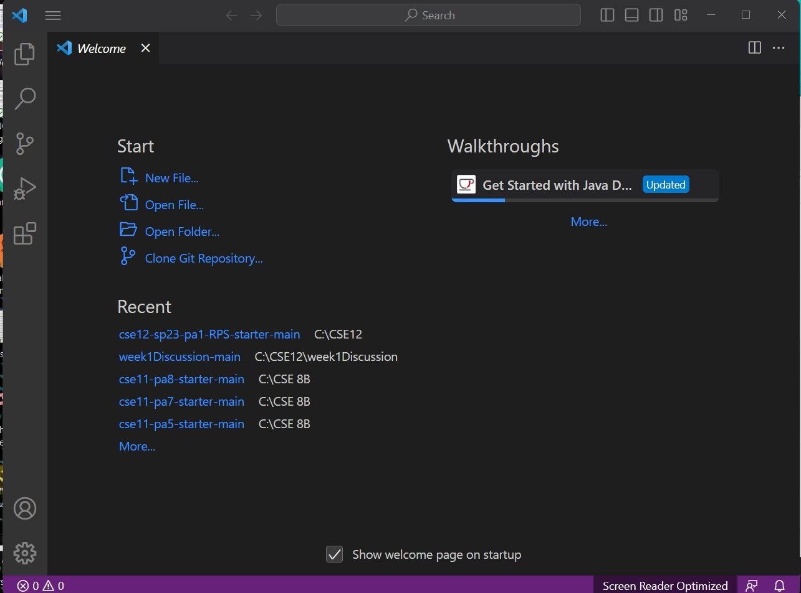
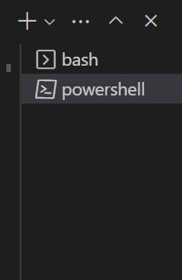
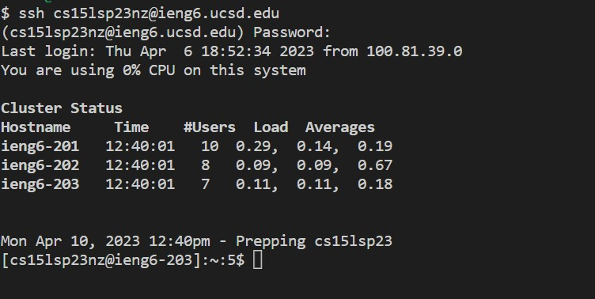
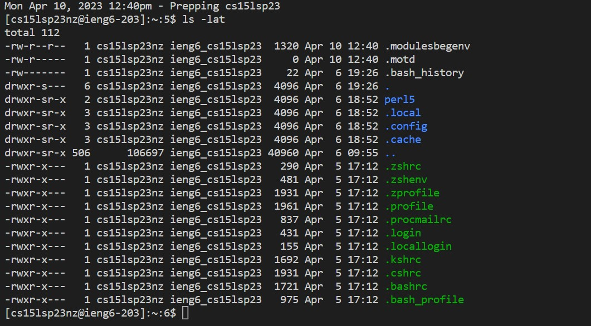
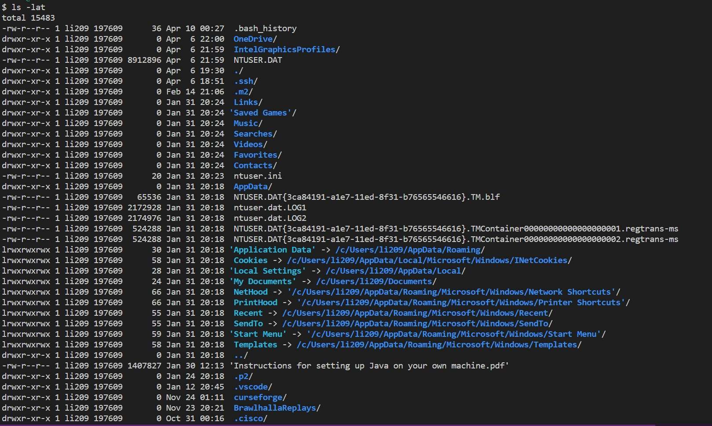

Lab Report 1
============
**Step 1:** Download the Virtual Studio Code on [Visual studio](https://code.visualstudio.com/Download) (choose the version that match your system)



**Step 2:** Windows users: install [Git](https://gitforwindows.org/)


**Step 3:** Open terminal in VScode -> view -> terminal


**Step 4:** Open the command palette by pressing Ctrl + Shift + P and enter Select Default Profile (Click on Git Bash from the options)

**Step 5: Only Windows users need to follow this step** Now your terminal should have two options when pressing + icon: powershell and bash


**Step 6:** In the terminal, enter command `$ ssh cs15lsp23aa@ieng6.ucsd.edu` (aa should be replaced by your own course-specific username)

Then use your course-specific password to login (The password won't be shown on terminal when you enter)

If you are not sure about the username or password, use this [link](https://sdacs.ucsd.edu/~icc/index.php) to look up your account or change password:

You may receive a massage warn you about connecting once you enter the correct password - ignore the message and type yes

**Step 7:** Once connection is established, your terminal should look like this


If you see this message in your terminal, you are connected to the CSE basement server! Give a round of applause to yourself!

**Step 8:** Commands time!
Now you are connected to the remote computer, you can start trying some commands! Try these commands both on you computer and the remote computer!
````
cd ~

cd

ls -lat

ls -a

ls <directory> where <directory> is /home/linux/ieng6/cs15lsp23/cs15lsp23abc, where the abc is one of the other group members’ username

cp /home/linux/ieng6/cs15lsp23/public/hello.txt ~/

cat /home/linux/ieng6/cs15lsp23/public/hello.txt
````

Here is `$ ssh ls -lat` result on the remote PC:


Here is `$ ssh ls -lat` result on the my PC:

(TO LOG OUT THE REMOTE SERVER `$ ssh exit`)
